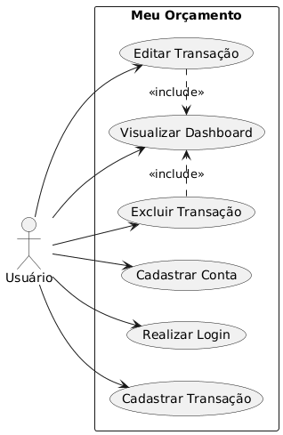
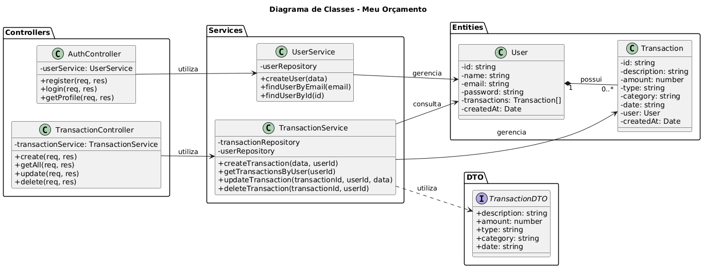

# Meu Orçamento

**Um sistema minimalista e eficiente para o controlo de finanças pessoais.**

## 📖 Contexto e Problema
A gestão financeira pessoal é frequentemente prejudicada por métodos locais e engessados, como cadernos ou planilhas presas a um único computador, o que dificulta o registo de gastos no momento em que eles acontecem na rua. O **Meu Orçamento** nasceu exatamente dessa necessidade prática: criar uma solução na nuvem para que o utilizador possa gerir as suas finanças de forma instantânea e **a partir de qualquer dispositivo** (smartphone, tablet ou computador). O sistema resolve o problema da mobilidade e do rastreio financeiro, centralizando todas as movimentações numa interface web limpa, sempre disponível e focada no essencial.

## 🎯 Requisitos Gerais
Em alto nível, o sistema garante ao utilizador a capacidade de:
* Criar uma conta e autenticar-se de forma segura.
* Registar, editar e apagar transações financeiras (receitas e despesas).
* Categorizar os gastos (ex: Alimentação, Transporte, Lazer) para melhor análise.
* Visualizar um painel (Dashboard) com o saldo atual, total de receitas e total de despesas.

## 👥 Papéis dos Usuários
Para a atual iteração do sistema, existe apenas um ator principal:
* **Utilizador Padrão (Cliente):** Pessoa física que interage com o sistema para gerir exclusivamente o seu próprio orçamento. Tem acesso total ao CRUD (Criar, Ler, Atualizar, Apagar) das suas próprias transações, sendo os seus dados isolados e protegidos.

## 🛠️ Stack Tecnológica
O projeto foi desenvolvido com uma arquitetura Cliente-Servidor (API RESTful), adotando rigorosamente a Programação Orientada a Objetos Clássica e os princípios SOLID.

* **Frontend:** React, TypeScript, Vite, Tailwind CSS, Axios.
* **Backend:** Node.js, Express, TypeScript, JWT, Bcrypt.
* **Base de Dados:** MySQL 8.0 (via Docker) operando com SQL Nativo (`mysql2`), implementando o Padrão Repository — **sem utilização de ORMs**.

## 🖼️ Modelagem do Sistema
* **Diagrama Casos de Uso**:
Abaixo está o diagrama que ilustra as interações principais do usuário com a aplicação.



> **Nota:** Para ler a especificação completa, consulte o [Documento de Casos de Uso](./docs/modelagem/CASOS_DE_USO.md).
---
* **Diagrama de Classes:**


## 🚀 Como Executar o Projeto Localmente (Guia para Desenvolvedores)

### Pré-requisitos
Certifique-se de ter instalado na sua máquina:
* Node.js (versão 18 ou superior)
* Docker e Docker Compose
* Git

### Passo 1: Clonar o Repositório
```bash
git clone [https://github.com/seu-usuario/seu-repositorio.git](https://github.com/seu-usuario/seu-repositorio.git)
cd seu-repositorio
```

### Passo 2: Iniciar a Base de Dados (Docker)
Na raiz do projeto, inicie o contentor do MySQL:
```bash
docker compose up -d
```

### Passo 3: Configurar e Rodar o Backend
Abra um terminal e aceda à pasta do backend:
```bash
cd backend
npm install
```
*Crie um ficheiro `.env` na pasta `backend` com as variáveis de ambiente necessárias (ex: `DB_HOST=localhost`, `DB_USER=root`, `DB_PASSWORD=root`, `JWT_SECRET=sua_chave`).*

Inicie o servidor de desenvolvimento:
```bash
npm run dev
```

### Passo 4: Configurar e Rodar o Frontend
Abra um novo terminal e aceda à pasta do frontend:
```bash
cd frontend
npm install
```

Inicie a interface de utilizador:
```bash
npm run dev
```

O backend estará a correr em `http://localhost:3000` e o frontend estará acessível no link gerado pelo Vite (geralmente `http://localhost:5173`).

---
## Integrantes: 
* Jackson Marques De Oliveira - Desenvolvedor