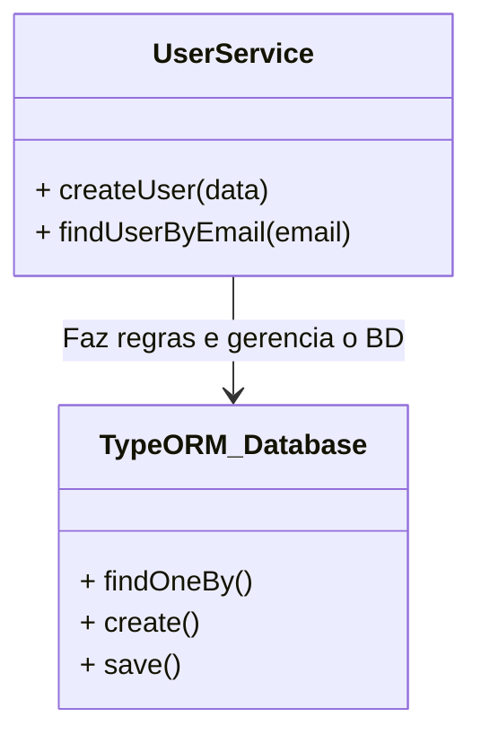
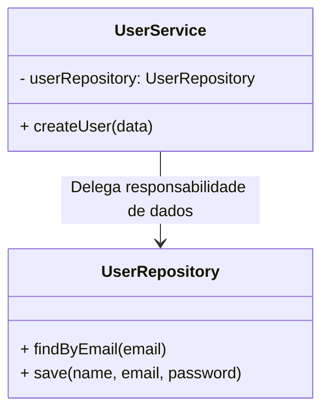
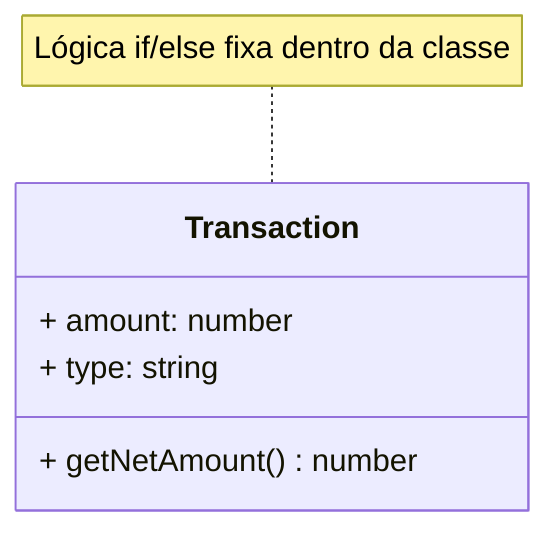
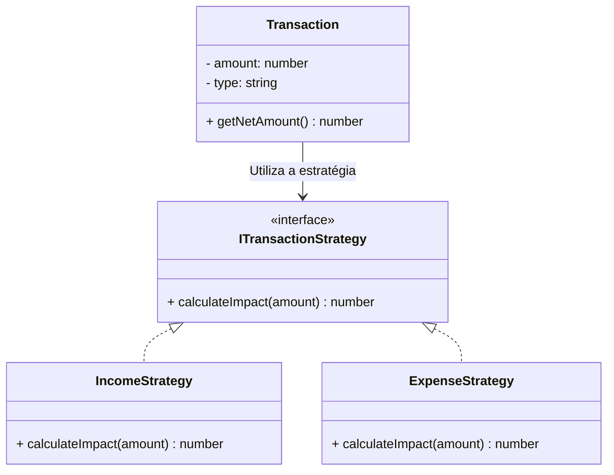
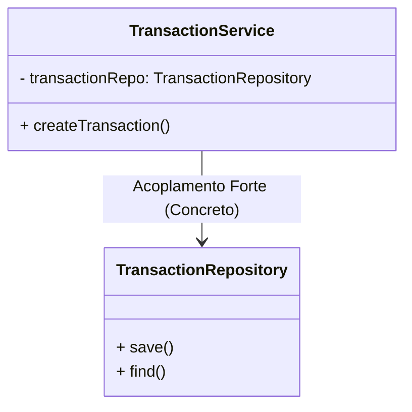
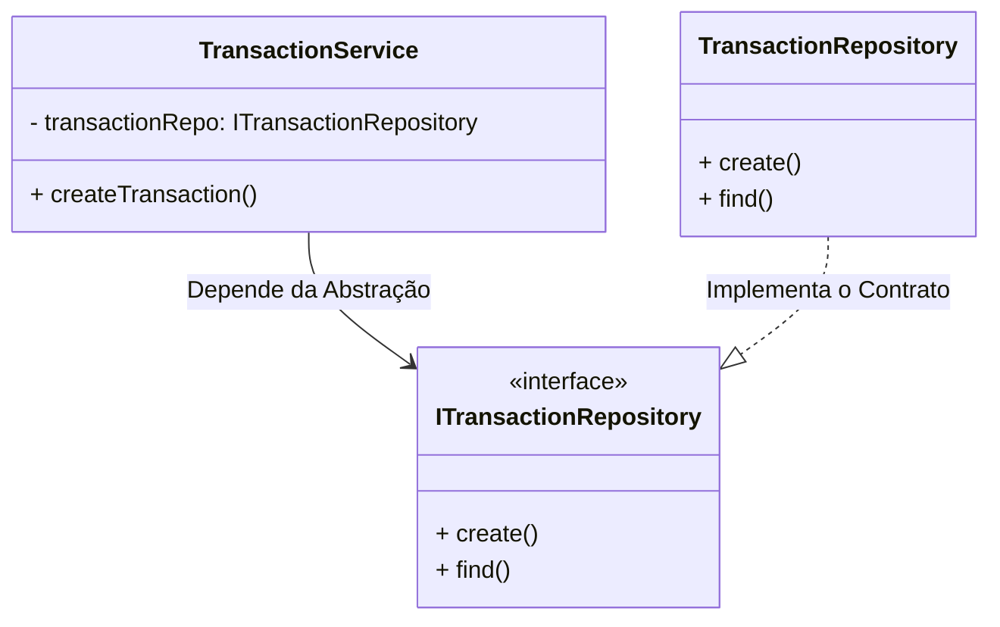

# Relatório de Correções de Design - Princípios SOLID (Issue #7)

Este documento detalha as refatorações arquiteturais realizadas no backend do projeto. Para cada princípio SOLID violado na arquitetura inicial, são apresentados o problema, o código e diagrama violados, bem como a solução aplicada com o novo código e diagrama.

---

## 1. Princípio da Responsabilidade Única (SRP)

### 🔴 O Erro (Violação)
A nossa camada de Serviço (`UserService`) estava responsável não apenas por ditar as regras de negócio (como verificar se o e-mail já existe ou encriptar senhas), mas também por acionar os métodos diretos do banco de dados (através do ORM), misturando a lógica de negócio com a lógica de persistência de dados.

### ❌ Código Violado
```typescript
export class UserService {
  // O Serviço interage diretamente com o Banco/ORM
  async createUser(data: any) {
    const existingUser = await AppDataSource.getRepository(User).findOneBy({ email: data.email });
    if (existingUser) throw new Error("E-mail já em uso");

    const user = AppDataSource.getRepository(User).create(data);
    return await AppDataSource.getRepository(User).save(user); // SQL misturado no Serviço
  }
}
```

### ❌ Diagrama de Classes Violado


### 🟢 A Solução (Correção)
Isolámos a lógica de banco de dados numa classe específica chamada `UserRepository`. O Controlador lida com a requisição, o Serviço lida com a regra de negócio e o Repositório assume a responsabilidade única de executar o SQL.

### ✅ Código Corrigido
```typescript
// UserRepository.ts (Responsabilidade: Só SQL)
export class UserRepository {
  async save(name, email, password) {
    await pool.execute('INSERT INTO users (name, email, password) VALUES (?, ?, ?)', [name, email, password]);
  }
}

// UserService.ts (Responsabilidade: Só Regras)
export class UserService {
  private userRepository = new UserRepository();

  async createUser(data: any) {
    // Delega o SQL para o repositório
    const existingUser = await this.userRepository.findByEmail(data.email);
    if (existingUser) throw new Error("E-mail já em uso");
    return await this.userRepository.save(data.name, data.email, data.password);
  }
}
```

### ✅ Diagrama de Classes Corrigido


---

## 2. Princípio Aberto/Fechado (OCP)

### 🔴 O Erro (Violação)
Para calcular o valor líquido de uma transação (se soma ou subtrai ao saldo), o sistema dependia de um `if/else` validando uma string literal `type`. Se o sistema precisasse de um novo tipo de transação (ex: "estorno"), seria obrigatório alterar o código fonte da classe, correndo o risco de quebrar o que já funcionava.

### ❌ Código Violado
```typescript
export class Transaction {
  public amount: number;
  public type: string; // 'income' ou 'expense'

  public getNetAmount(): number {
    // Violação: Código engessado, exigindo novos IFs para novos tipos
    if (this.type === 'income') {
      return this.amount;
    } else if (this.type === 'expense') {
      return -this.amount;
    }
    return 0;
  }
}
```

### ❌ Diagrama de Classes Violado


### 🟢 A Solução (Correção)
Implementámos o padrão **Strategy**. Criámos uma interface `ITransactionStrategy` e classes concretas para cada comportamento (`IncomeStrategy`, `ExpenseStrategy`). O sistema agora está "Aberto para expansão" (podemos criar novas estratégias) mas "Fechado para modificação" (não precisamos de mexer na classe base).

### ✅ Código Corrigido
```typescript
// ITransactionStrategy.ts
export interface ITransactionStrategy {
  calculateImpact(amount: number): number;
}

// IncomeStrategy.ts
export class IncomeStrategy implements ITransactionStrategy {
  calculateImpact(amount: number) { return Math.abs(amount); }
}

// ExpenseStrategy.ts
export class ExpenseStrategy implements ITransactionStrategy {
  calculateImpact(amount: number) { return -Math.abs(amount); }
}

// Transaction.ts
export class Transaction {
  public getNetAmount(): number {
    let strategy: ITransactionStrategy = this.type === 'income' ? new IncomeStrategy() : new ExpenseStrategy();
    return strategy.calculateImpact(this.amount);
  }
}
```

### ✅ Diagrama de Classes Corrigido


---

## 3. Princípio da Inversão de Dependência (DIP)

### 🔴 O Erro (Violação)
A classe `TransactionService` (módulo de alto nível) dependia diretamente da implementação concreta da classe `TransactionRepository` (módulo de baixo nível). Isso criava um alto acoplamento; se mudássemos o banco de dados de MySQL para MongoDB, o Serviço teria de ser reescrito.

### ❌ Código Violado
```typescript
import { TransactionRepository } from "../repositories/TransactionRepository";

export class TransactionService {
  // Violação: Dependência de uma classe concreta
  private transactionRepo: TransactionRepository;

  constructor() {
    this.transactionRepo = new TransactionRepository(); // Fortemente acoplado
  }
}
```

### ❌ Diagrama de Classes Violado


### 🟢 A Solução (Correção)
Introduzimos a interface `ITransactionRepository` (um contrato). O Serviço agora depende estritamente desta abstração. A implementação concreta do MySQL (`TransactionRepository`) apenas assina este contrato. O Serviço deixou de saber qual é o banco de dados que está a ser utilizado por baixo.

### ✅ Código Corrigido
```typescript
import { ITransactionRepository } from "../repositories/ITransactionRepository";
import { TransactionRepository } from "../repositories/TransactionRepository";

export class TransactionService {
  // O serviço depende apenas da INTERFACE (Abstração)
  private transactionRepo: ITransactionRepository;

  constructor() {
    // Injeção da implementação que respeita o contrato
    this.transactionRepo = new TransactionRepository(); 
  }
}
```

### ✅ Diagrama de Classes Corrigido
