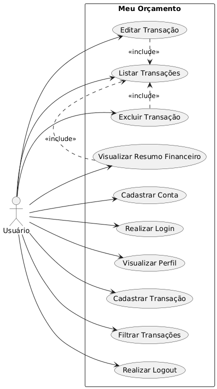

# 🗺️ Diagrama de Casos de Uso

Abaixo está o mapeamento do escopo funcional do sistema **Meu Orçamento**.



## Código Fonte (PlantUML)
<details>
<summary>Clique para ver o código usado para gerar o diagrama</summary>

```plantuml
@startuml
left to right direction

actor "Usuário" as Usuario

rectangle "Meu Orçamento" {

    usecase "Cadastrar Conta" as UC1
    usecase "Realizar Login" as UC2
    usecase "Visualizar Perfil" as UC3

    usecase "Cadastrar Transação" as UC4
    usecase "Listar Transações" as UC5
    usecase "Editar Transação" as UC6
    usecase "Excluir Transação" as UC7

    usecase "Visualizar Resumo Financeiro" as UC8
    usecase "Filtrar Transações" as UC9
    usecase "Realizar Logout" as UC10

    UC6 .> UC5 : <<include>>
    UC7 .> UC5 : <<include>>
    UC8 .> UC5 : <<include>>
}

Usuario --> UC1
Usuario --> UC2
Usuario --> UC3
Usuario --> UC4
Usuario --> UC5
Usuario --> UC6
Usuario --> UC7
Usuario --> UC8
Usuario --> UC9
Usuario --> UC10

@enduml