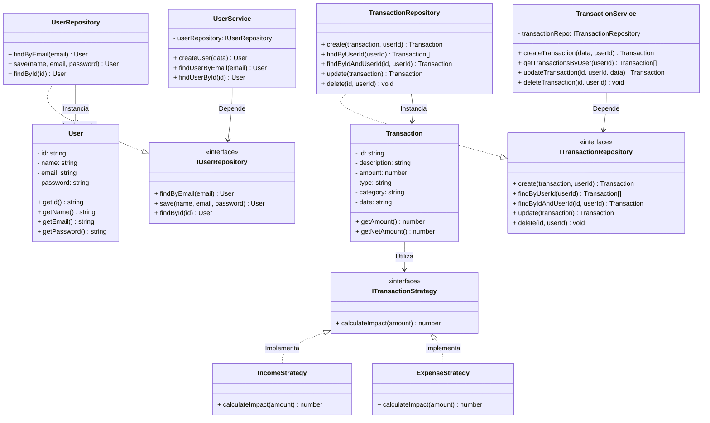

# Diagrama de Classes

## Objetivo

O Diagrama de Classes representa a estrutura estática do backend do sistema **Meu Orçamento**, evidenciando as principais classes, os seus atributos privados (encapsulamento), métodos e relacionamentos. Este artefato serve como base para a implementação das funcionalidades descritas no Diagrama de Casos de Uso e nas User Stories, garantindo o rigor da Programação Orientada a Objetos Clássica.

## Arquitetura (SOLID)

O backend foi totalmente refatorado para seguir uma arquitetura limpa baseada nos princípios S.O.L.I.D., separando as responsabilidades em cinco grupos principais:

- **Controllers:** Recebem as requisições HTTP e encaminham as operações.
- **Services:** Concentram estritamente as regras de negócio.
- **Interfaces (Contracts):** Garantem a Inversão de Dependência (DIP), definindo as regras para Repositórios e Estratégias.
- **Repositories:** Responsáveis exclusivos por executar o SQL Nativo (SRP), comunicando com a base de dados sem o uso de ORMs.
- **Strategies:** Classes dedicadas a calcular o impacto financeiro (Padrão Strategy - OCP).
- **Models:** Entidades clássicas com atributos privados (`private`) e métodos acessores (`getters`/`setters`).

## Classes e Relacionamentos Principais

### Camada de Apresentação e Negócio
- `AuthController` interage com o `UserService`.
- `TransactionController` interage com o `TransactionService`.

### Camada de Dados (Inversão de Dependência)
- O `UserService` depende da interface `IUserRepository`. A classe `UserRepository` implementa este contrato usando SQL.
- O `TransactionService` depende da interface `ITransactionRepository`. A classe `TransactionRepository` implementa este contrato.

### Padrão Strategy nas Transações
A classe `Transaction` delega o cálculo do valor líquido (soma ou subtração) para a interface `ITransactionStrategy`, que é implementada pelas classes concretas `IncomeStrategy` (Receitas) e `ExpenseStrategy` (Despesas). 

## Atendimento às User Stories

A arquitetura atualizada suporta todas as User Stories com alta manutenibilidade:

| User Story | Fluxo Arquitetural Envolvido |
|------------|--------------------|
| US01 – Cadastrar Conta | AuthController -> UserService -> IUserRepository -> UserRepository |
| US02 – Realizar Login | AuthController -> UserService -> IUserRepository |
| US03 – Visualizar Dashboard | TransactionController -> TransactionService -> ITransactionRepository |
| US04 – Cadastrar Transação | TransactionController -> TransactionService -> ITransactionRepository -> Transaction |
| US05 – Editar Transação | TransactionController -> TransactionService -> ITransactionRepository |
| US06 – Excluir Transação | TransactionController -> TransactionService -> ITransactionRepository |

## Diagrama (UML)

Abaixo encontra-se a modelagem visual do sistema gerada dinamicamente:

