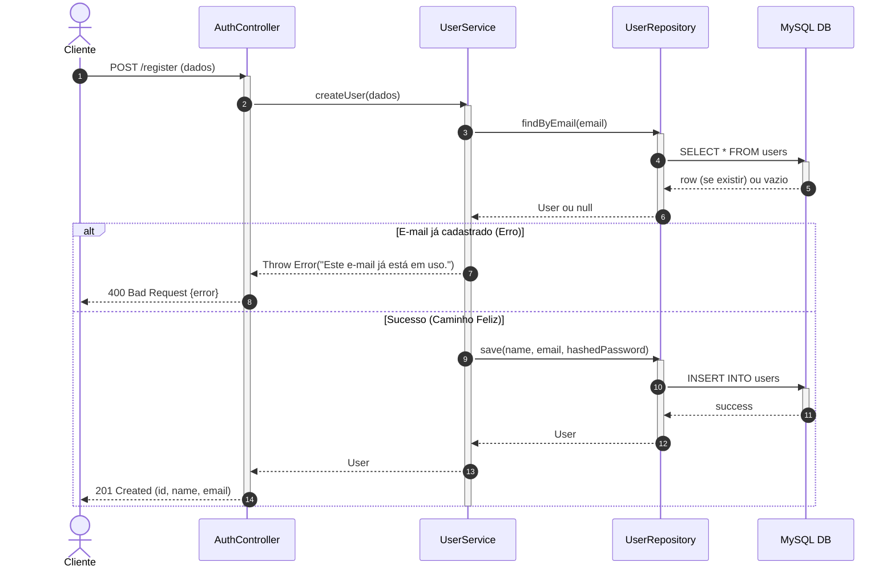
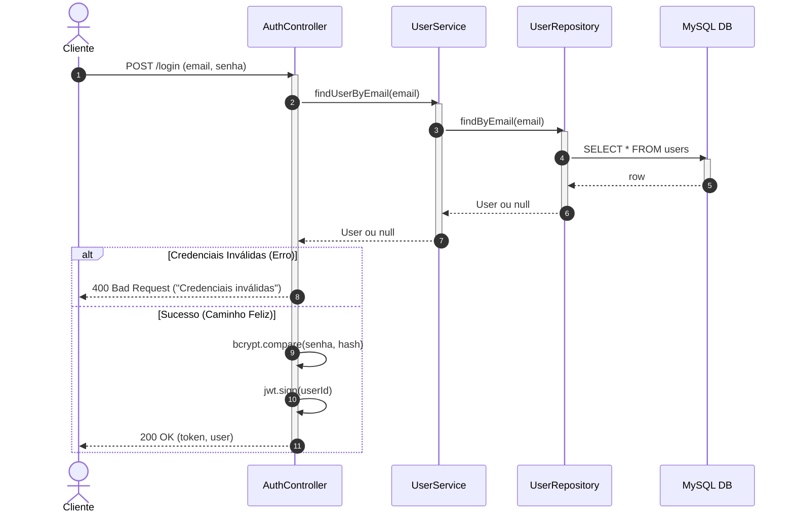
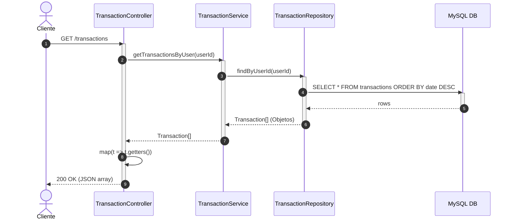
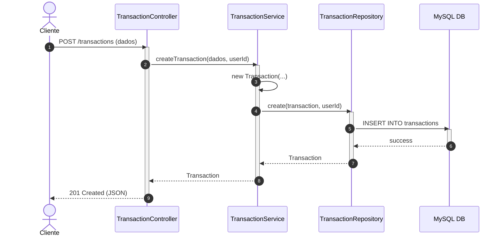
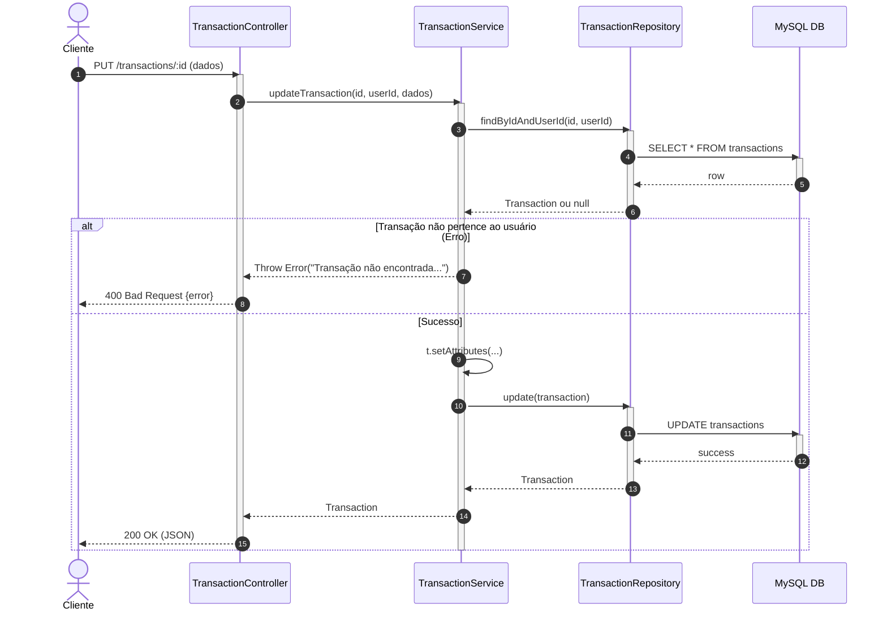
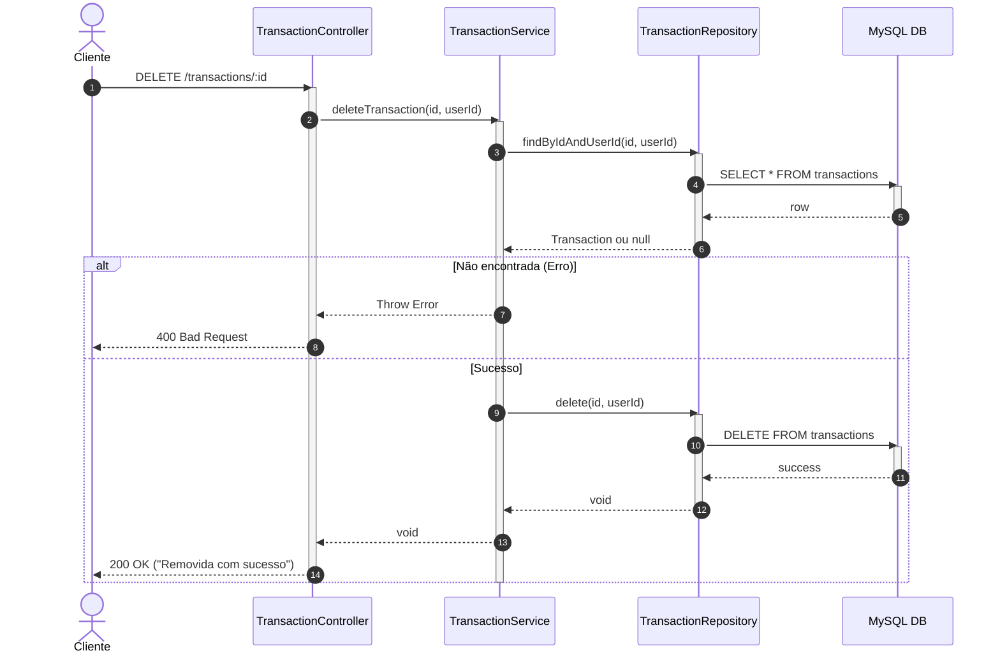

# Diagramas de Sequência

## US01 - Cadastrar Conta
**Fluxo:** O cliente envia os dados. O sistema verifica se o e-mail já existe; se sim, retorna erro (`alt` block). Se não, insere no banco de dados.

---

## US02 - Realizar Login
**Fluxo:** O sistema busca o e-mail, compara o *hash* da senha e, se for válido, assina um *token JWT*.

---

## US03 - Visualizar Dashboard
**Fluxo:** O cliente autenticado solicita a lista de transações. O Controller busca através do Service e devolve os dados mapeados para o frontend.

---

## US04 - Cadastrar Transação
**Fluxo:** Instanciação da classe Clássica `Transaction` e delegação da persistência ao repositório de SQL puro.

---

## US05 - Editar Transação
**Fluxo:** Verifica a existência e permissão do recurso. Atualiza utilizando os *Setters* da classe e salva no banco.

---

## US06 - Excluir Transação
**Fluxo:** Verifica a existência da transação pelo ID e UserID e executa a exclusão em cascata ou direta via SQL.

